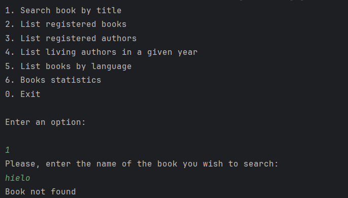
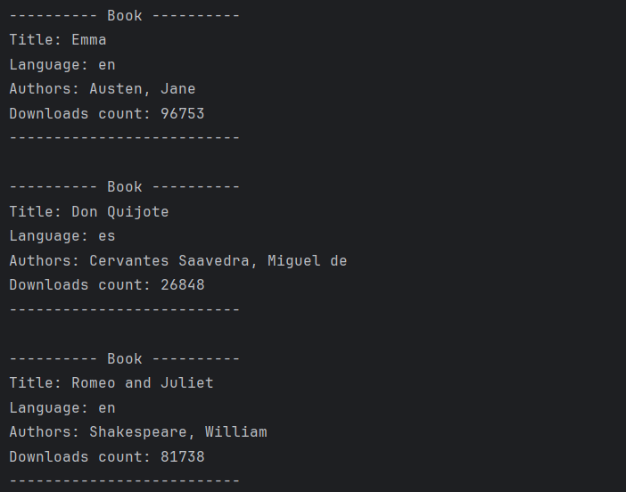
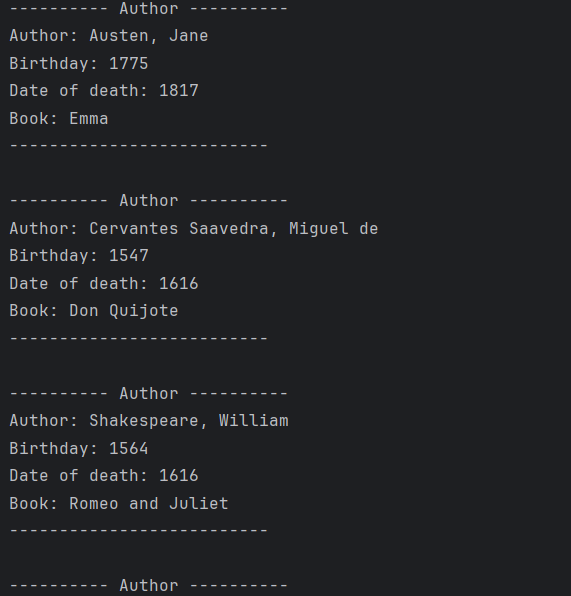
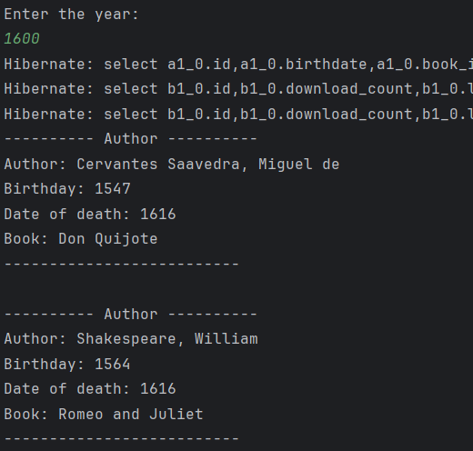
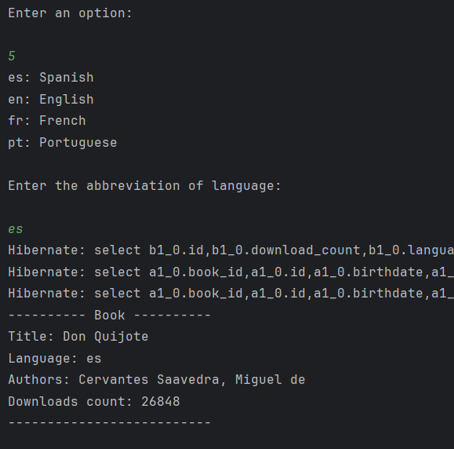
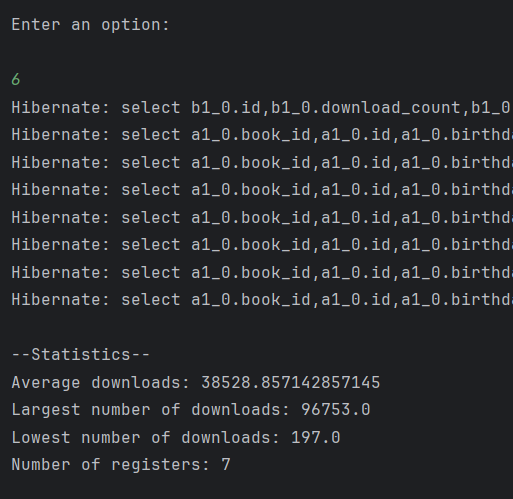

# 📚 Bookmatch

Bookmatch es una aplicación de consola desarrollada en **Java 24** con **Spring Boot**, **JPA** y **JPQL**, conectada a una base de datos **PostgreSQL** y a la API pública de [Gutendex](https://gutendex.com/).  
Es el resultado del *Challenge de Literatura* del programa **Oracle Next Education**.

## 🚀 Características principales
- Búsqueda de libros en la API pública Gutendex.
- Almacenamiento de resultados en una base de datos PostgreSQL.
- Evita duplicados comprobando si el libro ya está registrado.
- Asociación de libros con uno o varios autores.
- Consultas con **JPQL**:
  - Listar todos los autores y sus libros.
  - Buscar libros por idioma (`es`, `en`, `fr`, `pt`).
  - Filtrar por nombre de autor.
  - Listar autores vivos en un año dado.
- Estadísticas simples sobre descargas de libros.

## 🛠 Tecnologías utilizadas
- **Java 24**
- **Spring Boot**
- **Spring Data JPA** / **JPQL**
- **PostgreSQL**
- **Maven**
- **Gutendex API** (API pública de libros)

## 📸 Resultados de ejecución

### Menú principal

### Libros registrados

### Autores registrados

### Autores vivos en un año dado

### Libros por idioma

### Estadísticas

